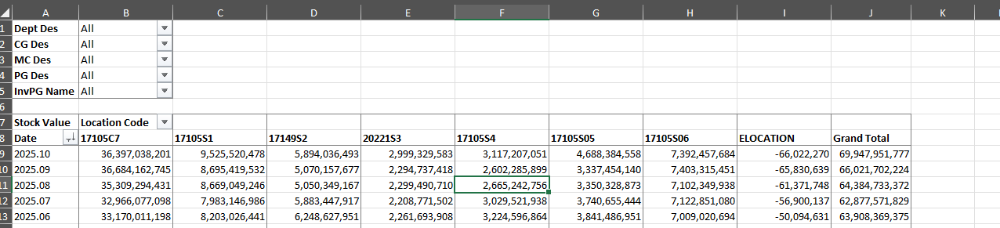

# ⚙️ Automating Monthly Stock Value Report

---

## 📘 Giới thiệu
Bộ phận Merchandise cần theo dõi **Stock Value hàng tháng** theo nhiều cấp độ:  
- Loại hàng hóa (Import, Outright, Consign)  
- Ngành hàng  
- Nhà cung cấp (Vendor)  

Tuy nhiên, các dữ liệu như **giá cost, tồn kho, loại hàng, ngành hàng** lại nằm rải rác ở nhiều file khác nhau.  
Hơn nữa, dữ liệu tồn kho tải về hàng ngày rất lớn (với hàng chục nghìn SKU và nhiều cửa hàng), khiến việc **tổng hợp và tính toán Stock Value thủ công** trở nên mất nhiều thời gian, dễ lỗi, và không nhất quán.

Dự án này được thực hiện nhằm **tự động hóa quy trình tổng hợp, làm sạch và tính toán Stock Value** bằng Power Query và Pivot Table, giúp quản lý Merchandise có thể xem báo cáo nhanh chóng, chính xác, và dễ dàng mở rộng.

---

## 🎯 Mục tiêu dự án
- Giảm thiểu thao tác thủ công trong việc tính toán Stock Value.  
- Tự động cập nhật và tính toán khi có dữ liệu tồn kho tháng mới.  
- Tập trung dữ liệu từ nhiều nguồn về một hệ thống duy nhất.  
- Tạo báo cáo động theo nhiều tiêu chí khác nhau (loại hàng, ngành hàng, nhà cung cấp, v.v.).  

---

## 🧩 Giải pháp thực hiện
1. **Sử dụng Power Query** để:
   - Nhập và xử lý dữ liệu tồn kho lớn (Inventory).  
   - Làm sạch và chuẩn hóa dữ liệu từ nhiều bảng (Cost, Item Category, Vendor, Product Type…).  
   - Tạo **Data Model** để liên kết các bảng dữ liệu rời rạc lại với nhau.  

2. **Xây dựng báo cáo bằng Pivot Table**:
   - Thiết kế các bảng và biểu đồ thể hiện Stock Value theo tháng, theo ngành hàng, và theo nhà cung cấp.  
   - Tạo slicer/filter để người dùng tùy chọn xem dữ liệu theo nhu cầu.  

3. **Cải tiến (2025.10)**:
   - Tối ưu hiệu suất Power Query bằng các kỹ thuật nâng cao:
     - `Table.Buffer`, `List.Buffer`, `Nested Table`  
     - Giảm kích thước file từ **40MB xuống dưới 16MB**  
     - Giảm thời gian load dữ liệu từ **hơn 15 phút xuống còn dưới 2 phút**  

---

## 📊 Kết quả đạt được
- ✅ Báo cáo Stock Value được **tự động cập nhật hàng tháng**.  
- ⚙️ Xử lý được dữ liệu lớn, hàng trăm nghìn dòng SKU tồn kho.  
- 📈 Tập trung dữ liệu rời rạc về một mô hình thống nhất, giúp tạo nhiều loại báo cáo khác nhau.  
- 🚀 Cải thiện hiệu suất mạnh mẽ, tăng tốc độ load gấp **7 lần**.  

---

## 🛠️ Công cụ & Kỹ thuật sử dụng
- **Microsoft Excel**  
- **Power Query (M language)**  
- **Pivot Table**  
- **Data Modeling & Performance Optimization**  
- **Buffering Techniques (Table.Buffer, List.Buffer)**  

---

## 📸 Kết quả
### Stock Value Report (per month)

  

---

## ✉️ Tác giả
**Tram Dang Tai**  
📍 Merchandise Assistant Database  
📧 [Liên hệ qua LinkedIn](https://www.linkedin.com/in/tramdangtai)
